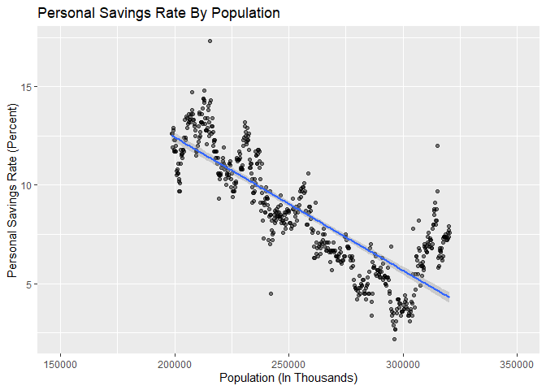

``` r
c("tidyverse",
  "ggthemes",
  "dplyr"
  ) -> package_names  
for(package_name in package_names) {
  if(!is.element(package_name, installed.packages()[,1])) {
     install.packages(package_name,
                      repos = "http://cran.mtu.edu/")
  }
  library(package_name, character.only=TRUE,
          quietly=TRUE,verbose=FALSE)
}
```

    ## -- Attaching packages -------------------------------------------------------------------------- tidyverse 1.2.1 --

    ## v ggplot2 3.2.0     v purrr   0.3.2
    ## v tibble  2.1.3     v dplyr   0.8.3
    ## v tidyr   0.8.3     v stringr 1.4.0
    ## v readr   1.3.1     v forcats 0.4.0

    ## -- Conflicts ----------------------------------------------------------------------------- tidyverse_conflicts() --
    ## x dplyr::filter() masks stats::filter()
    ## x dplyr::lag()    masks stats::lag()

    ## Warning: package 'ggthemes' was built under R version 3.6.2

``` r
data("economics")
str(economics)
```

    ## Classes 'spec_tbl_df', 'tbl_df', 'tbl' and 'data.frame': 574 obs. of  6 variables:
    ##  $ date    : Date, format: "1967-07-01" "1967-08-01" ...
    ##  $ pce     : num  507 510 516 512 517 ...
    ##  $ pop     : num  198712 198911 199113 199311 199498 ...
    ##  $ psavert : num  12.6 12.6 11.9 12.9 12.8 11.8 11.7 12.3 11.7 12.3 ...
    ##  $ uempmed : num  4.5 4.7 4.6 4.9 4.7 4.8 5.1 4.5 4.1 4.6 ...
    ##  $ unemploy: num  2944 2945 2958 3143 3066 ...

# How does U.S. population size affect personal savings rate?

``` r
ggplot(data = economics, mapping = aes(x = pop, y = psavert)) +
  geom_point(alpha = .5) +
  scale_x_log10() +
  stat_smooth(method = "lm") +
  xlim(150000, 350000) +
  xlab("Population (In Thousands)") +
  ylab("Personal Savings Rate (Percent)") +
ggtitle("Personal Savings Rate By Population") 
```

    ## Scale for 'x' is already present. Adding another scale for 'x', which
    ## will replace the existing scale.

<!-- -->

Depicition of personal savings rate by an increasing U.S. population
over time.

# Summary:

The economics datset used to produce the above visualization is an R
built-in dataset. The data is a U.S. economic time series which comes
from <https://fred.stlouisfed.org/>. The dataset contains 6 separate
variables, with 574 observations. The data is monthly data from July
1st, 1967 to April 1st, 2015. The variables focused on for this
visualization to answer the question were pop and psavert. pop is simply
the total population in thousands, and psavert is personal savings rate.
Personal savings rate is the percentage of your income which is put into
savings. I wanted to look at and see if there was any relationship
between or affect on personal savings rate by the growing U.S.
population over time. To do this, I used ggplot2 to create a scatter
plot, plotting the population data on the x-axis and the personal
savings rate data on the y-axis. To this scatterplot, a smaoother was
added in order to better show the pattern and trend of the plot. The
x-axis scale had to be adjusted to 150000, 350000 in order to better
fullY show the plot. From the findings, it is clearly evident that there
is a negative correlation between the two variables. As U.S. population
increases over time, personal savings rate is seen to be decreasing.
